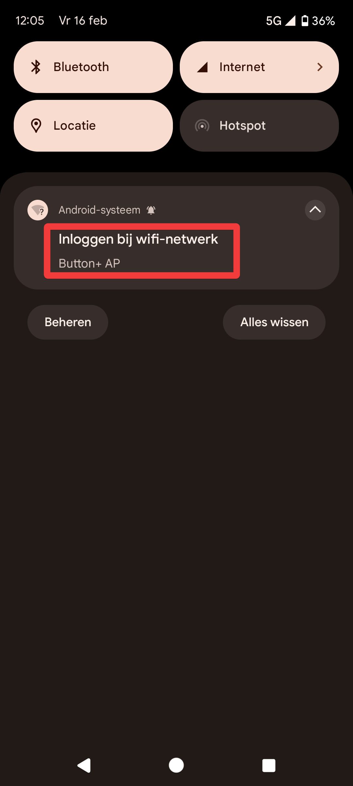

# Basic Configuration
{: .no_toc }

## Table of contents
{: .no_toc .text-delta }
- TOC
{:toc}

## First connection to Wi-Fi
After installing and powering up your Button+ you will probably look like this:

> **Note:** 
> If it does not show anything on the big screen, the bars are showing "hello world" and the LEDs are flashing. Then you 
> probably got a device with test firmware, it needs to be flashed with production firmware using USB. Go to the 
> troubleshooting page and see the section [LEDs are flashing and the Bars are showing 'hello world'](./troubleshooting.md#cause-your-button-is-shipped-with-the-test-firmware)

### Connection Steps:
  1. Take your phone and open the Wi-Fi settings. Turn on the Wi-Fi in case it is not. Connect to "Button+ AP", a password 
  is not needed
  2. After connecting to your Button+ there should be a notification that say you need to log in to the wifi-network. 
  Click it, and you'll be redirected to the Button+ Wi-Fi configuration page

  | Step 1                                                                                                  | Step 2                                                                                                       |
  |---------------------------------------------------------------------------------------------------------|--------------------------------------------------------------------------------------------------------------|
  |  |  |
  
  3. Once you're on the Wi-Fi configuration page click the hamburger menu button on the top right. Next click 
  "Configure new AP" 
  
  | Step 3.1                                                                                                | Step 3.2                                                                                            |
  |---------------------------------------------------------------------------------------------------------|-----------------------------------------------------------------------------------------------------|
  |  |  |

  4. You will get a list of all available Wi-Fi networks. If your network is not listed, click "Next" to look for it. 
  When you see the desired network click it, and the name will be added in the SSID field, enter your Wi-Fi Password in
  the "Passphrase" field and click the "Apply" button. It should now connect to your network.
  > If the password was incorrect it will tell you it failed to connect. Double-check the password you've entered and try again.
  
  | Step 4                                                                                                     |
  |------------------------------------------------------------------------------------------------------------|
  |  | 

  5. The device should reboot and connect your network. In some cases you will need it does not reboot, and you'll 
  have to reset your device. This can be done by pushing the reset button on the bottom right of your device.
 
  | Step 5                                                                                          |
  |-------------------------------------------------------------------------------------------------|
  |  | 

  6. Once the device is rebooted it will show you the IP address on the main display. You can now configure your Button+ 
  in your favorite web browser by typing `http://<ip address shown on the b+>/`.
  