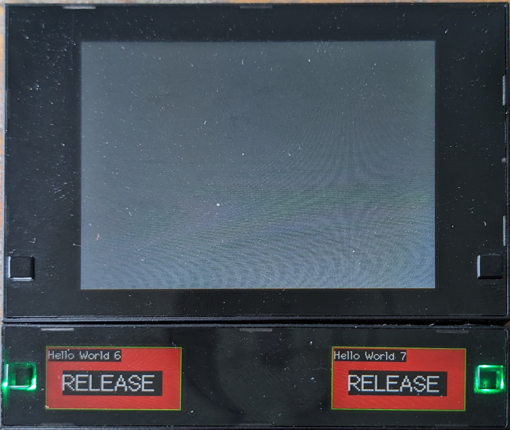

# Troubleshooting
{: .no_toc }

## Table of contents
{: .no_toc .text-delta }
- TOC
{:toc}

## Issue: Boot loop
Symptoms: Your Button+ is restarting all the time.

### Cause: Power supply
* Using a USB adapter: 
  > Try some different power supply's with at least 1A at 5V.

  > Try a different USB-C cable.

  > Try to connect the 3.3v wires to a 3.3v power supply.
* Using the 3.3v power cord:
  > Make sure that the power supply can supply at least 1A

  > Try another power supply.

  > In case of long or thin wiring please check the [section below](#cause-long-or-thin-cabling) 

### Cause: Long or thin cabling.

* Long and/or thin wiring will cause a voltage drop over the wire
  > Put the power supply in the box behind the Button+. If the wiring does not meet the requirements for 230V,
  > consider adding a 12v (or bigger) power supply and add a LM2596 DC-DC drop down converter behind your Button+.
  
  > Increase the voltage a bit but do not go over 3.6v! (see chapter 4.2 of the [ESP32-S3 datasheet](https://www.espressif.com/sites/default/files/documentation/esp32-s3_datasheet_en.pdf))
  
  > Add a capacitor behind your Button+. I suggest a capacitor of at least 470µF. This will act as a little buffer 
  > for the initial current.

## Issue: LEDs are flashing and the Bars are showing 'hello world'
Symptoms: Display module does not show you anything, Bars showing `hello world X` with red background and LEDs are 
flashing in different colors.

### Cause: Your Button+ is shipped with the Test firmware.
You will need to upload the firmware with a USB-C cable.
  > 1. Download the latest available firmware from the [Button+ site](https://button.plus/support/firmware)
  > 2. Extract the zip using your favorite archiver.
  > 3. Download and install [Python](https://www.python.org/downloads/) for your operating system.
  >    * [Windows](https://www.python.org/downloads/windows/)
  >    * [Linux/UNIX](https://www.python.org/downloads/source/)
  >    * [MacOS](https://www.python.org/downloads/macos/)
  >    * [Other](https://www.python.org/downloads/other/)
  > 4. Open a terminal windows and install esptool using pip 
  >    `pip install esptool` [more info](https://docs.espressif.com/projects/esptool/en/latest/esp32/installation.html)
  > 5. Navigate to the folder where you extracted the firmware.
  > 6. For Windows, you can just run the `flash.bat` file. For the other OS's you will need to run this command:
  >    `python -m esptool --chip esp32s3 --baud 921600 --before default_reset --after hard_reset write_flash -z --flash_mode dio --flash_freq 80m --flash_size 16MB 0x0 bootloader.bin 0x8000 partitions.bin 0xa000 ota_data_initial.bin 0x10000 firmware.bin`